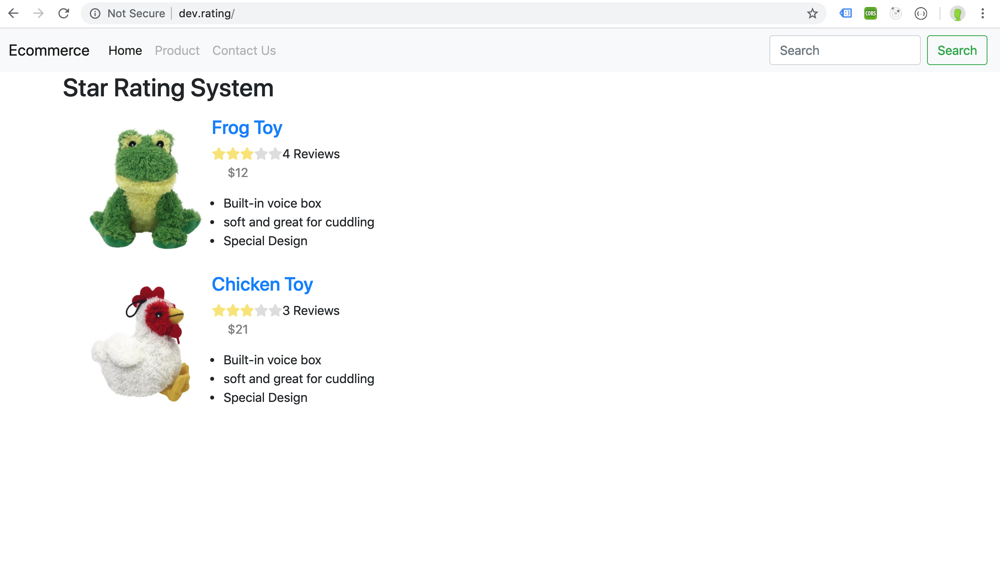
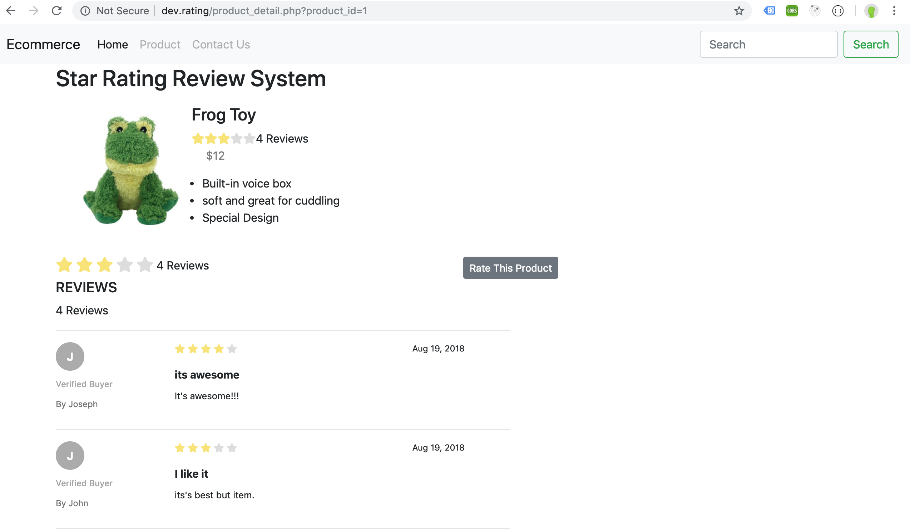
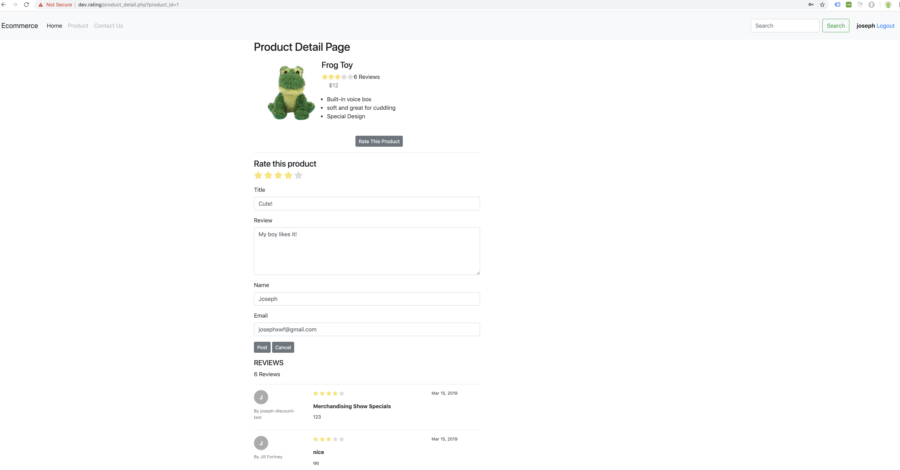

# Star Rating Review System

This is a product star rating system that can be integtated with you PHP framework (Laravel, Cakephp, etc)

## Prerequisites

* Apache Web Server
* PHP7.2
* MySql

## Installation

* Install Apache Server

* Install PHP
  * `brew search php`
  * `brew install php@7.2`
  
* Install MySql 
  * `brew install mysql@5.7`

## Development set up and run the app

1. Import sql files into mysql databse 
   `mysql -u username -p databsename < product.sql`
   `mysql -u username -p databsename < product_rating.sql`
   `mysql -u username -p databsename < product_users.sql`
2. Set up local Apache development server
   *   After insatll apache, put the project in the apache web directory
   *   run `sudo apachectl start`  you can access the webpage by visiting http://localhost .
   
3. Configuration 
   *  Option 1: Customer need login to make a comment or rating
      *  go to class/Rating.php, change $settingClass = 'loginRequired'
   *  Option2: Customer doesn't need login to make a comment or rating
      *  go to class/Rating.php, change $settingClass = ''
   
   
    
    
